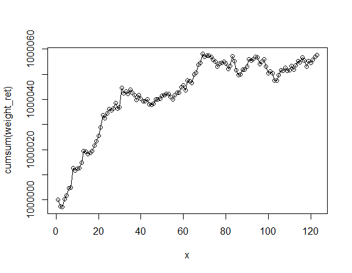

# optimal_portfolio_weights

## Purpose
The idea of this project was to optimize the weighting within a given portfolio of stocks using a Monte-Carlo Simulation.  I wanted to see how I could make the most risk-adverse portfolio given a set of stocks and $1 million to invest within this set of stocks.

## Process
I downloaded CSV files from Yahoo Finance within the time interval set for me and stashed them into an input folder. In C++, I read in the files and created a vector of vectors in order to store all the adjusted close prices into one matrix. After that, I was able to manipulate the data such as finding the Sharpe Ratios of each stock which I would later on use to help optimize the weights of the portfolio, as well as the daily returns, which I would use to help calculate the returns of the overall portfolio later. To optimize the weights, I first created a function that would use a Uniform Distribution from 0 to 1 that would create a weight for each stock and also sum to 1. I then used a Monte Carlo Simulation to simulate this process 10,000 times. Using a vector containing these 10,000 simulated weights, I optimized the portfolio by creating a portfolio of the close prices of all the stocks combined with 1 of the 10,000 weights. In essence, I ended up with 10,000 randomly generated portfolios to work with. Finally, I optimized which of these 10,000 portfolios were best by calculating which index in the vector of portfolios had the greatest Sharpe Ratio. Once that was done, I was able to write CSV files containing the weights and daily returns of each stock so that I could plot the Cumulative Returns of a portfolio given a $1 million initial investment in R. The picture of the plot is included above. Below is the table of stocks and their respective weights after running this simulation.

Below I included a graph of the cumulative returns for the optimal portfolio for the last year.

